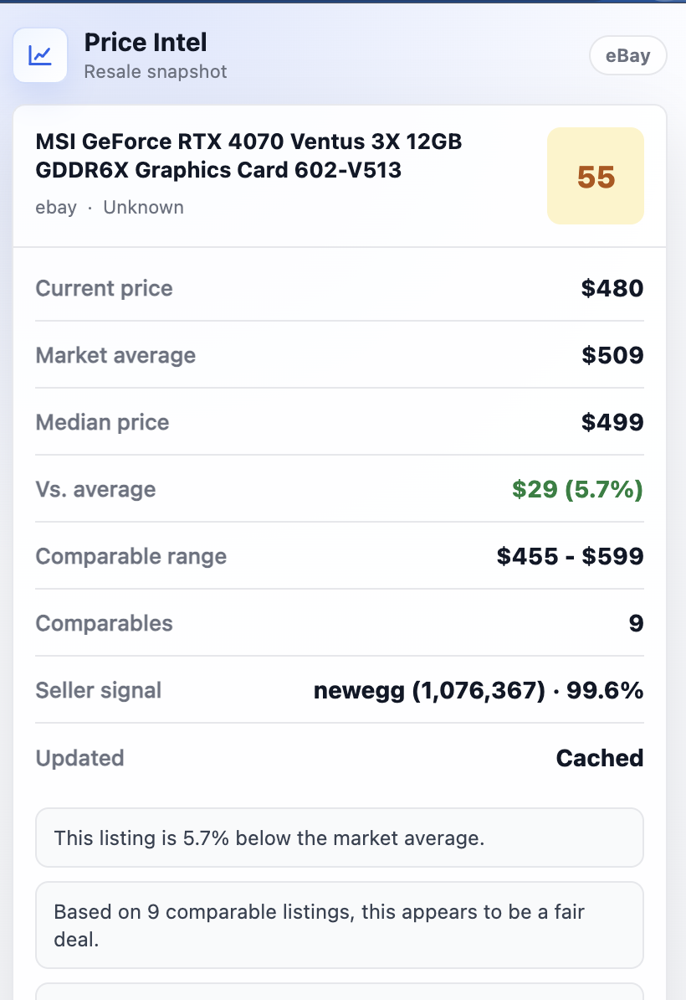
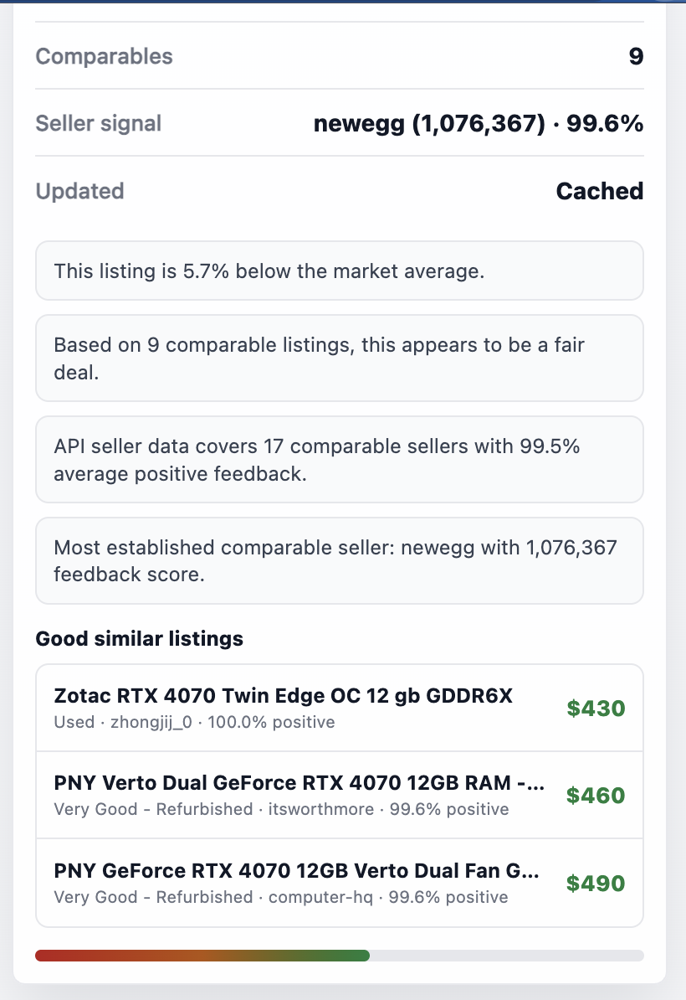

# Price Intel

Price Intel is a Chrome extension and FastAPI backend for evaluating resale opportunities on eBay. When a user opens an eBay listing, the extension captures product details, sends them to the backend, and displays a compact market snapshot with comparable listings, pricing context, and a deal score.

The project is designed around one practical question:

> Is this listing priced attractively compared with the current market?

## Screenshots

| Listing Analysis | Similar Listings |
| --- | --- |
|  |  |

## Features

- Chrome extension for eBay item pages and search result pages
- Popup UI with current price, market average, median, price range, comparable count, and deal score
- Similar-listing recommendations from live comparable results
- FastAPI backend with endpoints for single-listing collection, bulk collection, and market analysis
- eBay Browse API integration for market comparable search and item detail enrichment
- Product normalization that maps title variations to stable cache keys
- Cached market snapshots for faster repeat lookups
- Seller signal summaries and deterministic pricing insights

## How It Works

1. The content script detects whether the user is viewing an eBay listing or search results page.
2. For item pages, it extracts the listing title, price, category, condition, and item ID.
3. The extension sends the listing to the FastAPI backend.
4. The backend builds a normalized product profile and enriches it with eBay API metadata when available.
5. Price Intel searches for comparable listings, filters out poor matches, and calculates market statistics.
6. If cached market data exists, the backend can reuse cached pricing while still fetching fresh API comparables for similar listings.
7. The popup renders the latest analysis from Chrome local storage.

## Architecture

```text
eBay page
  -> Chrome content script
  -> FastAPI backend
  -> eBay Browse API
  -> SQLite/Postgres database
  -> Chrome popup
```

### Chrome Extension

| File | Purpose |
| --- | --- |
| `backend/chrome_extension/content.js` | Detects eBay pages, extracts listing data, and sends it to the backend |
| `backend/chrome_extension/popup.js` | Renders the latest analysis, market metrics, insights, and similar listings |
| `backend/chrome_extension/popup.html` | Defines popup markup and styles |
| `backend/chrome_extension/manifest.json` | Manifest V3 configuration and host permissions |

### Backend

| File | Purpose |
| --- | --- |
| `backend/main.py` | FastAPI app and request flow for collection and analysis |
| `backend/services/normalize.py` | Product title normalization, profile enrichment, and comparable matching |
| `backend/services/market.py` | Deal scoring, insight generation, seller summaries, and recommendations |
| `backend/providers/ebay_api.py` | eBay Browse API client and token refresh logic |
| `backend/db/models.py` | SQLAlchemy models for observed listings and market snapshots |
| `backend/schemas/` | Pydantic request schemas |

## Product Normalization

Marketplace titles are noisy, so Price Intel converts titles into structured profiles before comparing listings.

For example, these titles should resolve to the same product family:

```text
RTX 4070 FE 12GB
NVIDIA GeForce RTX 4070 Founders Edition
```

The normalization service extracts fields such as:

- product type
- brand
- series
- model
- variant
- edition
- memory
- title tokens
- accessory or parts status

When eBay metadata is available, the backend enriches profiles with category IDs, product identifiers, item aspects, and condition groups. That helps prevent bad comparables such as replacement parts, boxes, accessories, or mismatched product variants from affecting the market estimate.

## API Endpoints

### `POST /collect`

Stores one observed listing.

```json
{
  "name": "NVIDIA RTX 4070 Founders Edition 12GB",
  "category": "Graphics Cards",
  "marketplace": "ebay",
  "current_price": 499.99,
  "condition": "Used"
}
```

### `POST /collect_bulk`

Stores multiple observed listings from a search results page.

```json
{
  "listings": [
    {
      "name": "NVIDIA RTX 4070 Founders Edition 12GB",
      "category": "Graphics Cards",
      "marketplace": "ebay",
      "current_price": 499.99,
      "condition": "Used"
    }
  ]
}
```

### `POST /analyze`

Analyzes a listing against the current market.

```json
{
  "name": "NVIDIA RTX 4070 Founders Edition 12GB",
  "category": "Graphics Cards",
  "current_price": 499.99,
  "condition": "Used",
  "item_id": "1234567890"
}
```

The response includes:

- `average_price`
- `median_price`
- `lowest_price`
- `highest_price`
- `listing_count`
- `comparable_count`
- `deal_score`
- `price_delta`
- `percent_delta`
- `cached`
- `normalized_name`
- `product_attributes`
- `insights`
- `seller_summary`
- `recommended_listings`
- `comparables`

## Local Development

### Prerequisites

- Python 3.10+
- Chrome or another Chromium-based browser
- eBay developer credentials for the Browse API
- A database URL supported by SQLAlchemy, such as SQLite or Postgres

### Environment Variables

Create a `.env` file in the project root:

```bash
DATABASE_URL=sqlite:///./backend/price_intel.db
EBAY_API_TOKEN=your_access_token
EBAY_CLIENT_ID=your_client_id
EBAY_CLIENT_SECRET=your_client_secret
```

`EBAY_API_TOKEN` can be used directly. If it expires, the backend can refresh it when `EBAY_CLIENT_ID` and `EBAY_CLIENT_SECRET` are set.

### Start the Backend

Install dependencies for your environment, then run:

```bash
uvicorn backend.main:app --reload
```

The API will be available at:

```text
http://localhost:8000
```

### Load the Extension

1. Open Chrome and go to `chrome://extensions`.
2. Enable Developer Mode.
3. Click **Load unpacked**.
4. Select `backend/chrome_extension/`.
5. Start the backend on `localhost:8000`.
6. Open an eBay listing and click the Price Intel extension icon.

## Development Notes

- The extension currently focuses on eBay listings.
- The backend creates database tables on startup through SQLAlchemy metadata.
- Cached market snapshots make repeat analysis faster, while live API calls can still provide fresh similar listings.
- Insight generation is deterministic and intentionally simple for now.
- The normalization layer is structured so additional product categories can be added over time.

## Roadmap

- Add richer normalization for more product categories
- Improve scoring with historical pricing and demand signals
- Add a React-based extension UI
- Add automated tests for normalization and market scoring
- Add screenshots and demo assets

## License

No license has been specified yet.
